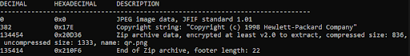

# format_magic solution

## by mario

## Premise:
This challenge is in the steganography/miscellaneous category. This means that we are tasked with finding hidden information or data within something else (To learn more about  steganography, the wiki can be [found here](https://en.wikipedia.org/wiki/Steganography)). The only file we are provided with in this challenge is a jpg image [format_magic.jpg.](http://chal.ctf-league.osusec.org/format_magic.jpg)

## First Step:
Being that this is a steganography challenge, we know that there must be some hidden data in the image given to us. There are many steganography tools that can be used to find hidden files inside other files. The one that I used for this challenge is called Binwalk. [Binwalk](https://www.kali.org/tools/binwalk/) allows us to scan a file and see if any other files are also contained within the original file. If we run binwalk with the *-B* flag, it will scan a file for file signatures and report what other file types it can find. We can use this utility on the supplied image by running *binwalk -B format_magic.jpg* and get the following output:

As we can see from the output, in addition to the jpg file, there is also the end of a zip archive also located in the image. However, we only know where the end of the zip archive ends and not where it starts. To find the beginning of this zip archive we first need to know its “magic bytes”.

## Magic Bytes
Every file has a specific file signature or *magic bytes* that identify the beginning of a particular file type. Some also have these signatures at the end of the file, such as zip archives. This is how binwalk was able to find the end of the zip. To locate where this zip archive begins we first find the end of the jpg image. To find the end we can look at this [guide](http://www.file-recovery.com/jpg-signature-format.htm) on the jpg signature format. In this guide, we find that the ending bytes of a jpg file must be FF D9. By opening the image in an online hex editor such as [Hexedit](https://hexed.it/), we can search for these ending bytes to find where the image ends. Using the search utility on the right side of the page, search for the hex value *FFD9*. The result will take us to this section in the file:

Here we can see where the jpg image ends. 

## Extracting the Zip Archive
If we refer to the [list](https://en.wikipedia.org/wiki/List_of_file_signatures) of file signatures, we can see that the *magic bytes* at the beginning of a zip archive are *50 4B 03 04*. Looking at the bytes right after the end of the jpg, we can see that they are *FF 4B 03 04.* As you can see, the only difference between the two is that the *50* has been swapped out with *FF*. This is why binwalk did not see the beginning of the zip file and only the end. If we change the byte right after *D9* from *FF* to *50*, we will be able to extract the zip archive as its own file. After changing the byte, the file should look as follows in hexedit:

Export this file with the changes and run the same binwalk command from before on this new file *binwalk -B format_magic_edit.jpg*. If the file has been changed properly we will get the following output:

Now that binwalk sees the entire zip archive, it is time to extract it. By running binwalk with the -e and -z flags, binwalk will extract the other files it finds within the image and put them into a subdirectory. So to get the zip archive we run  *binwalk -e -z format_magic_edit.jpg*. Within the new subdirectory we will find the hidden zip archive: *20D36.zip*. 

## Unlocking the Zip Archive
If we try to extract from the zip archive that has been taken out of the jpg file, we find that it is password protected. Another tool that we can use to get around this is [fcrackzip](https://www.kali.org/tools/fcrackzip/). We can give fcrackzip a dictionary in the form of a text file and it will try each entry until it finds the password. For this particular challenge we were informed that the password was an english word, however fcrackzip is also capable of brute forcing passwords. If we download a text file such as [this one](http://www.math.sjsu.edu/~foster/dictionary.txt) with english words, fcrackzip should be able to find the password. By putting the *dictionary.txt* we downloaded and the *20D36.zip* that we extracted earlier in the same directory, we can run the following command: *fcrackzip -u -D dictionary.txt 20D36.zip*. The *-u* flag tells fcrackzip to try each password by attempting to unzip the zip archive. The *-D* flag tells it to use the supplied text file as a dictionary for possible passwords. After running this command we will get the following output: 

Now that we know the password, we can extract the file inside.

## Reading the QR Code
After opening the zip archive, we find one file inside called *qr.png*. Opening this image we find an incomplete colorful qr code:

We cannot read this qr code yet, so we will need to make some changes to it. By using this online [qr code maker](https://merricx.github.io/qrazybox/), we can fill in a qr template and extract the data from it. By creating a new project we can start by filling in the template. Copying from the color qr code, the template looks as shown below:

The last step in this process is to find the correct error correction level and mask pattern. To do this click on the blue squares under the top right box in the qr editor to get the following Format Info Pattern menu:

Every qr code has an error correction level and mask pattern to make sure that data portrayed in the qr code is readable. If we look at the color qr code, we can see that the pattern under the top right box matches the error correction level *L* and mask pattern “3”. Therefore our Format info pattern menu should look as such:

Click save to go back to the full qr code with the changes you made applied. 

At this point, our template matches the colorful qr code and we have enough of the qr code to find what it is encoding.  At the top, click tools and then select the *Extract QR Information* option.  After this, we will get the following output:

At the bottom we can see the flag that was hidden in this challenge! 

## Flag: `osu{c0rrup7ion_m4g1c}.`

